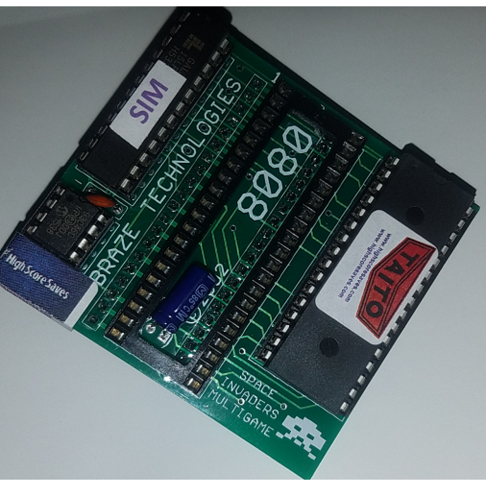

# Martians, old cpus and the borrow checker

Or how my stupidity can be a great example on how to please the borrow checker.

---

## What is this talk about

1. Space invaders.
2. Rust and the borrow checker.
3. Reading the documentation.

---

## The project



## First attempt

```
trait InputDevice {}
trait OutputDevice {}

struct ButtonDevice {}
impl InputDevice for ButtonDevice {}

struct SoundDevice {}
impl OutputDevice for SoundDevice {}


struct Cpu {
    pub inputs: Vec<Box<InputDevice>>,
    pub outputs: Vec<Box<OutputDevice>>,
}

struct Console {
    cpu: Cpu,
    sounds: Vec<SoundDevice>,
    buttons: Vec<ButtonDevice>,
}

impl Console {
    fn new() -> Console {
        let mut cpu = Cpu {
            inputs: Vec::new(),
            outputs: Vec::new(),
        };
        let sound1 = SoundDevice {};
        let sound2 = SoundDevice {};
        let sounds = vec![sound1, sound2];
        cpu.inputs.push(Box::new(sound1));
        cpu.inputs.push(Box::new(sound2));
        let button1 = ButtonDevice {};
        let button2 = ButtonDevice {};
        let buttons = vec![button1, button2];
        cpu.inputs.push(Box::new(button1));
        cpu.inputs.push(Box::new(button2));
        Console {
            cpu,
            sounds,
            buttons,
        }
    }
}
```

---

# The problem

```
error[E0277]: the trait bound `SoundDevice: InputDevice` is not satisfied
  --> src/lib.rs:31:25
   |
31 |         cpu.inputs.push(Box::new(sound1));
   |                         ^^^^^^^^^^^^^^^^ the trait `InputDevice` is not implemented for `SoundDevice`
   |
   = note: required for the cast to the object type `dyn InputDevice`

```

---

## The `Rc` attempt

```
use std::rc::Rc;

trait InputDevice {}
trait OutputDevice {}

struct ButtonDevice {}
impl InputDevice for ButtonDevice {}

struct SoundDevice {}
impl OutputDevice for SoundDevice {}


struct Cpu {
    pub inputs: Vec<Rc<InputDevice>>,
    pub outputs: Vec<Rc<OutputDevice>>,
}

struct Console {
    cpu: Cpu,
    sounds: Vec<Rc<SoundDevice>>,
    buttons: Vec<Rc<ButtonDevice>>,
}

impl Console {
    fn new() -> Console {
        let mut cpu = Cpu {
            inputs: Vec::new(),
            outputs: Vec::new(),
        };
        let sound1 = Rc::new(SoundDevice {});
        let sound2 = Rc::new(SoundDevice {});
        let sounds = vec![sound1.clone(), sound2.clone()];
        cpu.outputs.push(sound1.clone());
        cpu.outputs.push(sound2.clone());
        let button1 = Rc::new(ButtonDevice {});
        let button2 = Rc::new(ButtonDevice {});
        let buttons = vec![button1.clone(), button2.clone()];
        cpu.inputs.push(button1.clone());
        cpu.inputs.push(button2.clone());
        Console {
            cpu,
            sounds,
            buttons,
        }
    }
}
```

---

## The mutable attempt

```
use std::rc::Rc;

trait InputDevice {}
trait OutputDevice {}

enum Button {
    Coin,
    Left,
    Right,
    Shoot,
    Start,
}

struct ButtonDevice {
    pressed: Option<Button>,
}
impl ButtonDevice {
    fn press_button(&mut self, button: Button) {
        self.pressed = Some(button);
    }
}
impl InputDevice for ButtonDevice {}

struct SoundDevice {}
impl OutputDevice for SoundDevice {}


struct Cpu {
    pub inputs: Vec<Rc<InputDevice>>,
    pub outputs: Vec<Rc<OutputDevice>>,
}

struct Console {
    cpu: Cpu,
    sounds: Vec<Rc<SoundDevice>>,
    buttons: Vec<Rc<ButtonDevice>>,
}

impl Console {
    fn new() -> Console {
        let mut cpu = Cpu {
            inputs: Vec::new(),
            outputs: Vec::new(),
        };
        let sound1 = Rc::new(SoundDevice {});
        let sound2 = Rc::new(SoundDevice {});
        let sounds = vec![sound1.clone(), sound2.clone()];
        cpu.outputs.push(sound1.clone());
        cpu.outputs.push(sound2.clone());
        let button1 = Rc::new(ButtonDevice { pressed: None });
        let mut button2 = Rc::new(ButtonDevice { pressed: None });
        let buttons = vec![button1.clone(), button2.clone()];
        cpu.inputs.push(button1.clone());
        cpu.inputs.push(button2.clone());
        button2.press_button(Button::Coin);
        Console {
            cpu,
            sounds,
            buttons,
        }
    }
}
```

---

## `Rc`'s references are immutable

```
$ cargo build
   Compiling third_try v0.1.0 (/home/agustin/projects/blogposts/conferences/rust_meetup/20190129/third_try)
warning: variable does not need to be mutable
  --> src/lib.rs:51:13
   |
51 |         let mut button2 = Rc::new(ButtonDevice { pressed: None });
   |             ----^^^^^^^
   |             |
   |             help: remove this `mut`
   |
   = note: #[warn(unused_mut)] on by default

error[E0596]: cannot borrow data in a `&` reference as mutable
  --> src/lib.rs:55:9
   |
55 |         button2.press_button(Button::Coin);
   |         ^^^^^^^ cannot borrow as mutable

error: aborting due to previous error

For more information about this error, try `rustc --explain E0596`.
error: Could not compile `third_try`.

To learn more, run the command again with --verbose
```

---

## Well then, let's try `RefCell`

```
use std::cell::RefCell;

trait InputDevice {}
trait OutputDevice {}

enum Button {
    Coin,
    Left,
    Right,
    Shoot,
    Start,
}

struct ButtonDevice {
    pressed: Option<Button>,
}
impl ButtonDevice {
    fn press_button(&mut self, button: Button) {
        self.pressed = Some(button);
    }
}
impl InputDevice for ButtonDevice {}

struct SoundDevice {}
impl OutputDevice for SoundDevice {}


struct Cpu {
    pub inputs: Vec<RefCell<InputDevice>>,
    pub outputs: Vec<RefCell<OutputDevice>>,
}

struct Console {
    cpu: Cpu,
    sounds: Vec<RefCell<SoundDevice>>,
    buttons: Vec<RefCell<ButtonDevice>>,
}

impl Console {
    fn new() -> Console {
        let mut cpu = Cpu {
            inputs: Vec::new(),
            outputs: Vec::new(),
        };
        let sound1 = RefCell::new(SoundDevice {});
        let sound2 = RefCell::new(SoundDevice {});
        let sounds = vec![sound1.clone(), sound2.clone()];
        cpu.outputs.push(sound1.clone());
        cpu.outputs.push(sound2.clone());
        let button1 = RefCell::new(ButtonDevice { pressed: None });
        let mut button2 = RefCell::new(ButtonDevice { pressed: None });
        let buttons = vec![button1.clone(), button2.clone()];
        cpu.inputs.push(button1.clone());
        cpu.inputs.push(button2.clone());
        button2.press_button(Button::Coin);
        Console {
            cpu,
            sounds,
            buttons,
        }
    }
}
```

---

## `RefCell` hates traits

```
   Compiling fourth_try v0.1.0 (/home/agustin/projects/blogposts/conferences/rust_meetup/20190129/fourth_try)
error[E0277]: the size for values of type `(dyn InputDevice + 'static)` cannot be known at compilation time
  --> src/lib.rs:29:5
   |
29 |     pub inputs: Vec<RefCell<InputDevice>>,
   |     ^^^^^^^^^^^^^^^^^^^^^^^^^^^^^^^^^^^^^ doesn't have a size known at compile-time
   |
   = help: within `std::cell::RefCell<(dyn InputDevice + 'static)>`, the trait `std::marker::Sized` is not implemented for `(dyn InputDevice + 'static)`
   = note: to learn more, visit <https://doc.rust-lang.org/book/ch19-04-advanced-types.html#dynamically-sized-types-and-the-sized-trait>
   = note: required because it appears within the type `std::cell::RefCell<(dyn InputDevice + 'static)>`
   = note: required by `std::vec::Vec`
```

---

## OK FINE THEN

```
use std::cell::RefCell;

trait InputDevice {}
trait OutputDevice {}

enum Button {
    Coin,
    Left,
    Right,
    Shoot,
    Start,
}

struct ButtonDevice {
    pressed: Option<Button>,
}
impl ButtonDevice {
    fn press_button(&mut self, button: Button) {
        self.pressed = Some(button);
    }
}
impl InputDevice for ButtonDevice {}

struct SoundDevice {}
impl OutputDevice for SoundDevice {}


struct Cpu {
    pub inputs: Vec<RefCell<Box<InputDevice>>>,
    pub outputs: Vec<RefCell<Box<OutputDevice>>>,
}

struct Console {
    cpu: Cpu,
    sounds: Vec<RefCell<Box<SoundDevice>>>,
    buttons: Vec<RefCell<Box<ButtonDevice>>>,
}

impl Console {
    fn new() -> Console {
        let mut cpu = Cpu {
            inputs: Vec::new(),
            outputs: Vec::new(),
        };
        let sound1 = RefCell::new(Box::new(SoundDevice {}));
        let sound2 = RefCell::new(Box::new(SoundDevice {}));
        let sounds = vec![sound1.clone(), sound2.clone()];
        cpu.outputs.push(sound1.clone());
        cpu.outputs.push(sound2.clone());
        let button1 = RefCell::new(Box::new(ButtonDevice { pressed: None }));
        let mut button2 = RefCell::new(Box::new(ButtonDevice { pressed: None }));
        let buttons = vec![button1.clone(), button2.clone()];
        cpu.inputs.push(button1.clone());
        cpu.inputs.push(button2.clone());
        button2.get_mut().press_button(Button::Coin);
        Console {
            cpu,
            sounds,
            buttons,
        }
    }
}
```

---

```
Vec<Rc<RefCell<Box<InputDevice>>>>
```

---

"Direct mutability is another matter. I don't think that is planned, and I doubt it'll work with Rust's ownership system either. But just as a tip - for my own part, I've come to prefer Rc<Box<Trait>> over Rc<RefCell<Box<Trait>>>. (Or just Rc<Struct> when you don't need dynamic dispatch.) The reasoning is that for bigger objects; only some fields change during the lifetime of that object, and then you can internally Cell or RefCell those fields instead. E g, consider this user struct in a multiplayer game:

```
struct User {
    username: String,
    score: Cell<u64>,
    /* And many more fields */
}
```

This indicates a design where the username never changes during the lifetime of a user, but the score does (because it does not require a mutable reference to do so)."

---

Q&A

---
@title[Customize Slide Layout]

@snap[west span-50]
## Customize Slide Content Layout
@snapend

@snap[east span-50]

@snapend

---?color=#E58537
@title[Add A Little Imagination]

@snap[north-west]
#### Add a splash of @color[cyan](**color**) and you are ready to start presenting...
@snapend

@snap[west span-55]
@ul[spaced text-white]
- You will be amazed
- What you can achieve
- *With a little imagination...*
- And **GitPitch Markdown**
@ulend
@snapend

@snap[east span-45]
@img[shadow](assets/img/conference.png)
@snapend

---?image=assets/img/presenter.jpg

@snap[north span-100 headline]
## Now It's Your Turn
@snapend

@snap[south span-100 text-06]
[Click here to jump straight into the interactive feature guides in the GitPitch Docs @fa[external-link]](https://gitpitch.com/docs/getting-started/tutorial/)
@snapend
